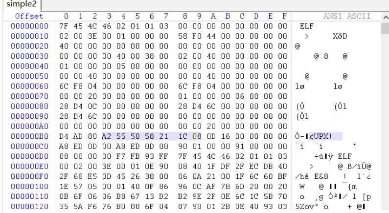
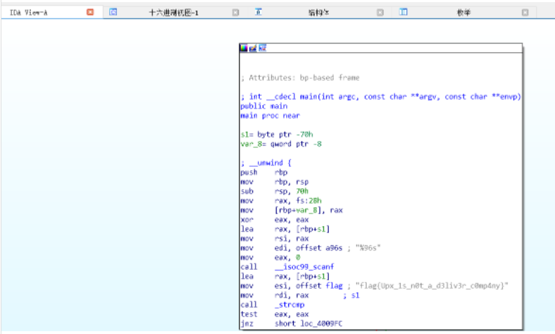

# Simple unpack


## **[目标]**
脱壳

## **[环境]**

kali

## **[工具]**
IDA, UPX

## **[分析过程]**

-  winhex打开后发现为upx壳



-  upx -d 脱壳后IDA打开即可看到flag

Then get the flag



```
flag{Upx_1s_n0t_a_d3liv3r_c0mp4ny}
```

